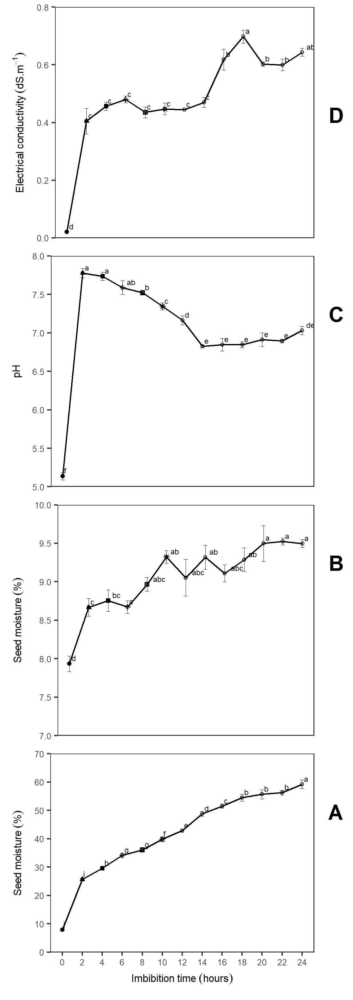

# Figures & tables

```{r fb, include=FALSE, echo=FALSE}

library(googlesheets)
library(tidyverse)
library(cowplot)

gss <- gs_ls()
fb <- gs_url("https://docs.google.com/spreadsheets/d/1gue-wSQcEu4nJigVZdUWsTfIIzhtxpDRdWAQiEHgKak/edit#gid=1437032568") 
dt <- fb %>% gs_read(ws = "fb") %>% dplyr::mutate(IBTH = factor(IBTH))
str(dt)
```


## Figures

(ref:swr) . Response of *Jatropha curcas* seeds after different imbition time. (A) Electrical Conductivity; (B) pH; (C) Seed Moisture and  (D) Seed Water Content. Means are represent with (±SE). n = 4.


```{r, swr, fig.cap= '(ref:swr)'}

av <- aov(HPT ~ IBTH, dt)
mc <- GerminaR::ger_testcomp(aov = av, comp = "IBTH", type = "snk")

pH_plot <- GerminaR::fplot(data = mc, type = "line",
                           x = "IBTH", xlab = "",
                           y = "mean", ylab = "pH",
                           z = "IBTH", lgd = "none", 
                           erb = T, sig = "sg", 
                           lmt = c(5,8.4), brk = 0.5, 
                           color = F)  + 
  geom_line(aes(group=1))  +
  geom_point(shape = 1, colour = "black", fill = "white", size = 1, stroke = 0.5)+
  
  theme(axis.title.x=element_blank(),
        axis.text.x=element_blank(),
        axis.ticks.x=element_blank())


av <- aov(ELC ~ IBTH, dt)
mc <- GerminaR::ger_testcomp(aov = av, comp = "IBTH", type = "snk")
ce_plot <- GerminaR::fplot(data = mc, type = "line",
                           x = "IBTH", xlab = "",
                           y = "mean", ylab = "Electrical conductivity (dS.m^{-1})",
                           z = "IBTH", lgd = "none", 
                           erb = T, sig = "sg", 
                           lmt = c(0,0.8),
                           color = F)  + 
  geom_line(aes(group=1))  +
  geom_point(shape = 1, colour = "black", fill = "white", size = 1, stroke = 0.5)+
  
  theme(axis.title.x=element_blank(),
        axis.text.x=element_blank(),
        axis.ticks.x=element_blank())


av <- aov(SMT ~ IBTH, dt)
mc <- GerminaR::ger_testcomp(aov = av, comp = "IBTH", type = "snk")
smt_plot <- GerminaR::fplot(data = mc, type = "line",
                           x = "IBTH", xlab = "",
                           y = "mean", ylab = "Seed moisture ('%')",
                           z = "IBTH", lgd = "none", 
                           erb = T, sig = "sg", 
                           lmt = c(7,9.9), brk = 0.5, 
                           color = F)+ 
  geom_line(aes(group=1))  +
  geom_point(shape = 1, colour = "black", fill = "white", size = 1, stroke = 0.5)+
  
  theme(axis.title.x=element_blank(),
        axis.text.x=element_blank(),
        axis.ticks.x=element_blank())

                      

av <- aov(SWC ~ IBTH, dt)
mc <- GerminaR::ger_testcomp(aov = av, comp = "IBTH", type = "snk")
swc_plot <- GerminaR::fplot(data = mc, type = "line",
                           x = "IBTH", xlab = "Imbibition time (hours)",
                           y = "mean", ylab = "Seed moisture ('%')",
                           z = "IBTH", lgd = "none", 
                           erb = T, sig = "sg", 
                           lmt = c(0,69), brk = 10, 
                           color = F)+ 
  geom_line(aes(group=1))  +
  geom_point(shape = 1, colour = "black", fill = "white", size = 1, stroke = 0.5)


## Plot figures

swr <- ggdraw(xlim = c(0, 0.55), ylim = c(0, 0.95))+
          draw_plot(ce_plot,  width = 0.4947, height = 0.25, x = 0.005, y = 0.695) +
          draw_plot(pH_plot,  width = 0.4894, height = 0.25, x = 0.011, y = 0.464) +
          draw_plot(smt_plot, width = 0.492, height = 0.25, x = 0.008, y = 0.232) +
          draw_plot(swc_plot, width = 0.488, height = 0.25, x = 0.012, y = 0.0) +
          draw_plot_label(
            label = c("A", "B", "C", "D"), 
            x = c(0.5, 0.5, 0.5, 0.5), 
            y = c(0.25, 0.48, 0.71, 0.939))


cowplot::ggsave("img/swr.png", dpi= 300, width = 210*0.45 , height = 297*0.9, units = "mm")



```


 Germination percentage (%) and mean germination time of Jatropha curcas seeds after each imbition time. The letter represent the mean difference with Student Newman Keuls test (P ≤ 0:05). Means are represent with (±SEM) of four replicates of 25 seeds