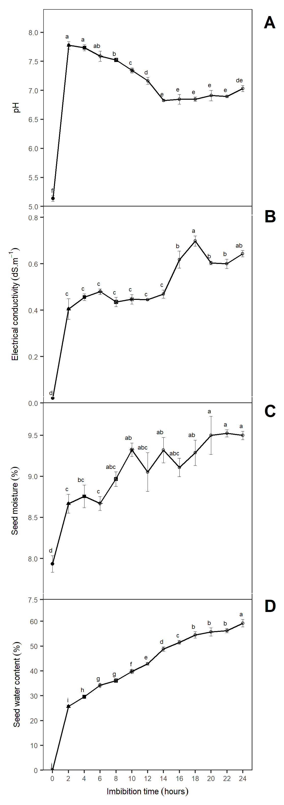

# Figures {-}

```{r fb, include=FALSE, echo=FALSE}

library(googlesheets)
library(tidyverse)
library(cowplot)
library(GerminaR)
library(FactoMineR)

gss <- gs_ls()
fb <- gs_url("https://docs.google.com/spreadsheets/d/1gue-wSQcEu4nJigVZdUWsTfIIzhtxpDRdWAQiEHgKak/edit#gid=1437032568") 

var <- fb %>% gs_read(ws = "fb") %>% 
  select(Block, IBTH, HPT, ELC, SFW = SWC.FW,	STW = SWC.TW, SDW = SWC.DW) %>% 
  dplyr::mutate(IBTH = factor(IBTH)) %>% 
  drop_na() %>% 
  mutate(
    SMT = (1 - (SDW/SFW))*100,
    SWC = ((STW-SFW)/SFW)*100
  )


grm <- fb %>% gs_read(ws = "fb") %>% 
  filter(SS == "S1") %>% 
  select(Block, IBTH,SNum, SGR.0:SGR.25) %>% 
  dplyr::mutate(IBTH = factor(IBTH)) %>%
  mutate_all(funs(replace(., is.na(.), 0)))
  
```


```{r swr, fig.cap= "Response of *Jatropha curcas* seeds after different imbibition time. (A) pH; (B) Electrical conductivity; (C) Seed moisture and  (D) Seed water content. The letter represent the mean difference with Student-Newman-Keuls test (p ≤ 0.05). Means are represent with (±SE). n = 4."}

av <- aov(HPT ~ IBTH, var)
mc <- GerminaR::ger_testcomp(aov = av, comp = "IBTH", type = "snk")

# summary(av)
# mc %>% arrange(sg)

plot1 <- GerminaR::fplot(data = mc, type = "line",
                           x = "IBTH", xlab = "",
                           y = "mean", ylab = "pH",
                           z = "IBTH", lgd = "none", 
                           erb = T, 
                           lmt = c(5,8.4), brk = 0.5, 
                           color = F)  + 
  
  geom_line(aes(group=1))  +
  geom_point(shape = 1, colour = "black", fill = "white", size = 1, stroke = 0.5)+
  theme(axis.title.x=element_blank(),
        axis.text.x=element_blank(),
        axis.ticks.x=element_blank()) +
  
          geom_text(aes_string(label = "sg", y = "ymax"), 
          colour = "black", size = 2 * 1, 
          vjust = -0.7, hjust = 1, 
          angle = 0, position = position_dodge(0.9))
  


av <- aov(ELC ~ IBTH, var)
mc <- GerminaR::ger_testcomp(aov = av, comp = "IBTH", type = "snk")

# summary(av)
# mc %>% arrange(sg)

plot2 <- GerminaR::fplot(data = mc, type = "line",
                           x = "IBTH", xlab = "",
                           y = "mean", ylab = "Electrical conductivity (dS.m^{-1})",
                           z = "IBTH", lgd = "none", 
                           erb = T, 
                           lmt = c(0,0.85), 
                           color = F)  + 
  geom_line(aes(group=1))  +
  geom_point(shape = 1, colour = "black", fill = "white", size = 1, stroke = 0.5)+
  theme(axis.title.x=element_blank(),
        axis.text.x=element_blank(),
        axis.ticks.x=element_blank())+
  
          geom_text(aes_string(label = "sg", y = "ymax"), 
          colour = "black", size = 2 * 1, 
          vjust = -0.7, hjust = 1, 
          angle = 0, position = position_dodge(0.9))


av <- aov(SMT ~ IBTH, var)
mc <- GerminaR::ger_testcomp(aov = av, comp = "IBTH", type = "snk")

plot3 <- GerminaR::fplot(data = mc, type = "line",
                           x = "IBTH", xlab = "",
                           y = "mean", ylab = "Seed moisture ('%')",
                           z = "IBTH", lgd = "none", 
                           erb = T, 
                           lmt = c(7.5,9.9), brk = 0.5, 
                           color = F)+
  
  geom_line(aes(group=1))  +
  geom_point(shape = 1, colour = "black", fill = "white", size = 1, stroke = 0.5)+
  theme(axis.title.x=element_blank(),
        axis.text.x=element_blank(),
        axis.ticks.x=element_blank()) +
  
          geom_text(aes_string(label = "sg", y = "ymax"), 
          colour = "black", size = 2 * 1, 
          vjust = -0.7, hjust = 1, 
          angle = 0, position = position_dodge(0.9))

# summary(av)
# mc %>% arrange(sg)

av <- aov(SWC ~ IBTH, var)
mc <- GerminaR::ger_testcomp(aov = av, comp = "IBTH", type = "snk")

plot4 <- GerminaR::fplot(data = mc, type = "line",
                           x = "IBTH", xlab = "Imbibition time (hours)",
                           y = "mean", ylab = "Seed water content ('%')",
                           z = "IBTH", lgd = "none", 
                           erb = T,  
                           lmt = c(0,69), brk = 10, 
                           color = F)+ 
  geom_line(aes(group=1))  +
  geom_point(shape = 1, colour = "black", fill = "white", size = 1, stroke = 0.5) +
  
          geom_text(aes_string(label = "sg", y = "ymax"), 
          colour = "black", size = 2 * 1, 
          vjust = -0.7, hjust = 1, 
          angle = 0, position = position_dodge(0.9))


# summary(av)
# mc %>% arrange(sg)

## Plot figures

swr <- ggdraw(xlim = c(0, 0.55), ylim = c(0, 0.95))+
  draw_plot(plot2,  width = 0.4947, height = 0.25, x = 0.005, y = 0.464) +
  draw_plot(plot1,  width = 0.488, height = 0.25, x = 0.012, y = 0.696 ) +
  draw_plot(plot3, width = 0.492, height = 0.25, x = 0.008, y = 0.232) +
  draw_plot(plot4, width = 0.488, height = 0.25, x = 0.012, y = 0.0) +
          draw_plot_label(
            label = c("D", "C", "B", "A"), 
            x = c(0.5, 0.5, 0.5, 0.5), 
            y = c(0.25, 0.48, 0.71, 0.939))

cowplot::ggsave("img/fig_01.png", dpi= 300, width = 210*0.45 , height = 297*0.9, units = "mm")
cowplot::ggsave("img/fig_01.tiff", dpi= 300, width = 210*0.45 , height = 297*0.9, units = "mm")



```


```{r grm, fig.cap='Germination response in *Jatropha curcas* seeds after different imbibition times. (A) Germination (%); (B) Mean germination time (days); (C) Germination synchrony and (D) Germination uncertainty (bits).  The letter represent the mean difference with Student-Newman-Keuls test (p ≤ 0.05). Means are represent with (±SE). n = 4.'}

grd <- GerminaR::ger_summary(SeedN = "SNum", evalName = "SGR.", data = grm) %>% 
  select(IBTH, SNum, GRP, MGT, UNC, SYN )

av <- aov(GRP ~ IBTH, grd)
mc <- GerminaR::ger_testcomp(aov = av, comp = "IBTH", type = "snk")

plot1 <- GerminaR::fplot(data = mc, type = "bar",
                           x = "IBTH", xlab = "",
                           y = "mean", ylab = "Germinability ('%')",
                           z = "IBTH", lgd = "none", 
                           erb = T, sig = "sg", 
                           lmt = c(0,100), brk = 10,
                           color = F) +
  
  theme(axis.title.x=element_blank(),
        axis.text.x=element_blank(),
        axis.ticks.x=element_blank())

# summary(av)
# mc %>% arrange(sg)

av <- aov(MGT ~ IBTH, grd)
mc <- GerminaR::ger_testcomp(aov = av, comp = "IBTH", type = "snk")

plot2 <- GerminaR::fplot(data = mc, type = "bar",
                           x = "IBTH", xlab = "",
                           y = "mean", ylab = "Mean germination time (days)",
                           z = "IBTH", lgd = "none", 
                           erb = T, sig = "sg", 
                           lmt = c(0,8.9), brk = 2,
                           color = F) +
  
  theme(axis.title.x=element_blank(),
        axis.text.x=element_blank(),
        axis.ticks.x=element_blank())

# summary(av)
# mc %>% arrange(sg)

av <- aov(SYN ~ IBTH, grd)
mc <- GerminaR::ger_testcomp(aov = av, comp = "IBTH", type = "snk")
plot3 <- GerminaR::fplot(data = mc, type = "bar",
                           x = "IBTH", xlab = "",
                           y = "mean", ylab = "Germination synchrony",
                           z = "IBTH", lgd = "none", 
                           erb = T, sig = "sg", 
                           lmt = c(0,0.59),
                           color = F) +
  
  theme(axis.title.x=element_blank(),
        axis.text.x=element_blank(),
        axis.ticks.x=element_blank())

# summary(av)
# mc %>% arrange(sg)

av <- aov(UNC ~ IBTH, grd)
mc <- GerminaR::ger_testcomp(aov = av, comp = "IBTH", type = "snk")
plot4 <- GerminaR::fplot(data = mc, type = "bar",
                           x = "IBTH", xlab = "Imbibition time (hours)",
                           y = "mean", ylab = "Germination uncertany (bits)",
                           z = "IBTH", lgd = "none", 
                           erb = T, sig = "sg", 
                           lmt = c(0,2.9),brk = 0.5,
                           color = F)

# summary(av)
# mc %>% arrange(sg)

## Plot figures

grv <- ggdraw(xlim = c(0, 0.55), ylim = c(0, 0.95))+
          draw_plot(plot1,  width = 0.505, height = 0.25, x = -0.005, y = 0.697) +
          draw_plot(plot2,  width = 0.49, height = 0.25, x = 0.01, y = 0.464) +
          draw_plot(plot3, width = 0.5, height = 0.25, x = 0.0, y = 0.232) +
          draw_plot(plot4, width = 0.503, height = 0.25, x = -0.003, y = 0.0) +
          draw_plot_label(
            label = c("D", "C", "B", "A"), 
            x = c(0.5, 0.5, 0.5, 0.5), 
            y = c(0.25, 0.48, 0.71, 0.939))


cowplot::ggsave("img/fig_02.png", dpi= 300, width = 210*0.45 , height = 297*0.9, units = "mm")
cowplot::ggsave("img/fig_02.tiff", dpi= 300, width = 210*0.45 , height = 297*0.9, units = "mm")


```


```{r correlation, echo=FALSE, fig.cap='Pearson correlation (p < 0.05) matrix in *Jatropha curcas* seeds after different imbibition times. Where: Dim, dimension IBTH, imbibition time; GRP, germination percentage; MGT, mean germination time; SYN, germination synchrony; pH, potential of hydrogen; EC, electrical conductivity; SWC, seed water content; SMT, seed moisture.', include=FALSE}

grc <- grd %>% select(-SNum) %>% 
  group_by(IBTH) %>% 
  summarise_all(funs(mean), na.rm = TRUE)


wvr <- var %>% select(-Block) %>% 
  group_by(IBTH) %>% 
  summarise_all(funs(mean), na.rm = TRUE) %>% 
  mutate(HPT= replace(HPT, IBTH== 0, NA))
  
  


cmt <- full_join(grc, wvr) %>% mutate(IBTH = as.numeric(IBTH))

ppi <- 300
png("img/fig_correlation.png", width=8*ppi, height=8*ppi, res=ppi)

fieldbook::plot_correlation(cmt,method = "pearson")

graphics.off()


cmt <- full_join(grc, wvr) %>% mutate(IBTH = as.numeric(IBTH))

ppi <- 300
png("img/fig_correlation.tiff", width=8*ppi, height=8*ppi, res=ppi)

fieldbook::plot_correlation(cmt,method = "pearson")

graphics.off()


```

```{r pca, fig.cap= "Principal Component Analysis from the variables in *Jatropha curcas* seeds after different imbibition times. Where: IBTH, imbibition time; GRP, germination percentage; MGT, mean germination time; SYN, germination synchrony; UNC, germination uncertainty; pH, potential of hydrogen; EC, electrical conductivity; SWC, seed water content; SMT, seed moisture; SDW, seed dry weight; SFW, seed fresh weight; STW, seed turgid weight."}

pca <- PCA(cmt, graph = F, scale.unit = TRUE, quanti.sup = 1)

# sink("pca.txt")
# summary(pca, nbelements = Inf)
# cat("\n")
# cat("\n")
# dimdesc(pca)
# sink()

ppi <- 300
png("img/fig_03.png", width=8*ppi, height=8*ppi, res=ppi)

# fieldbook::plot_PCA(cmt, type = "biplot")

plot.PCA(pca,choix="var",
         col.lab="white",
         title="Principal Component Analisys",
         autoLab = "y", cex = 0.8, shadowtext = T)
mtext('Dimension 1 (51.57%)', side=1, line=3)
mtext('Dimension 2 (23.46%)', side=2, line=3)

graphics.off()


ppi <- 300
png("img/fig_03.tiff", width=8*ppi, height=8*ppi, res=ppi)

# fieldbook::plot_PCA(cmt, type = "biplot")

plot.PCA(pca,choix="var", col.quanti.sup = "black",
         title="Principal Component Analisys",
         autoLab = "y", cex = 0.8, shadowtext = T)

graphics.off()


```


